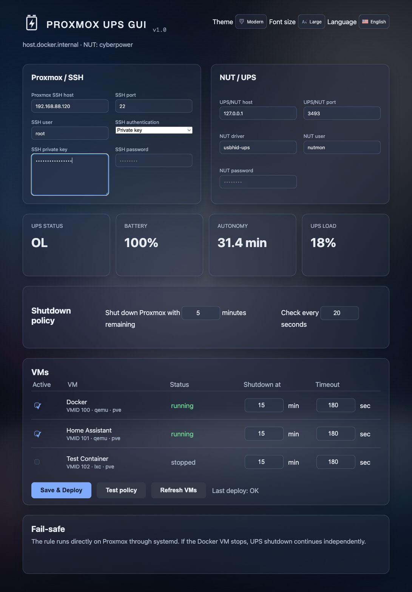

# Proxmox NUT Control

Docker web interface for configuring a NUT server on a Proxmox host over SSH. It generates the NUT configuration and a shutdown script that stops Docker containers in the configured order when the battery timer expires or `LOWBATT` is reported, then shuts down the host.

The header is imported from [mikrotik-ui-shared](https://github.com/ovikiss/mikrotik-ui-shared) during the Docker build. This app uses the shared Theme style, Font size and Language controls with a NUT/UPS mark instead of the MikroTik logo. Set `UI_SHARED_REPO` and `UI_SHARED_REF` as Docker build arguments to select another shared UI revision.

## Getting started

Make sure SSH password or private-key authentication to the Proxmox host works, then run:

```sh
mkdir -p data
docker compose up -d --build
```

Open `http://IP-of-the-machine-running-the-app:8080`. Configure the host, UPS and containers, test the connection, then deploy.

All connection, NUT, shutdown policy and VM settings are persisted in `/data/settings.json`. The app can read the legacy `/data/config.json` file during migration.

The same settings can be supplied through Compose environment variables. When a variable is set, it is applied at startup and persisted automatically to `/data/settings.json`. SSH uses exactly one selected method: set `PROXMOX_SSH_AUTH_METHOD=key` with `PROXMOX_SSH_KEY` containing the private key, or set `PROXMOX_SSH_AUTH_METHOD=password` with `PROXMOX_SSH_PASSWORD`. NUT credentials use `NUT_USER` and `NUT_PASSWORD`; use `CONTAINERS_JSON` for the container policy list. `UI_LANGUAGE`, `UI_THEME_STYLE` and `UI_FONT_SIZE` configure the shared header settings.

Compose variables include `PROXMOX_SSH_HOST`, `PROXMOX_SSH_PORT`, `PROXMOX_SSH_USER`, `PROXMOX_SSH_AUTH_METHOD`, `PROXMOX_SSH_KEY`, `PROXMOX_SSH_PASSWORD`, `PROXMOX_SSH_KNOWN_HOSTS`, `UPS_HOST`, `UPS_PORT`, `UPS_NAME`, `UPS_DRIVER`, `UPS_DESCRIPTION`, `NUT_USER`, `NUT_PASSWORD`, `UPSMON_PASSWORD`, `BATTERY_MINUTES`, `LOW_BATTERY_MINUTES`, `STOP_TIMEOUT`, `SHUTDOWN_COMMAND`, and `CONTAINERS_JSON`.

## Warnings

- The SSH account must be able to write to `/etc/nut`, `/usr/local/sbin` and restart NUT services; `root` is typically used.
- Without `ssh_known_hosts`, the app automatically accepts the SSH host key on first connection. For production, mount a `known_hosts` file and configure its path.
- A backup is created at `/root/nut-gui-backup-YYYYMMDD-HHMMSS` on Proxmox before deployment.
- Verify actual container names with `docker ps --format '{{.Names}}'`.
- Deployment enables or restarts `nut-server` and `nut-monitor`; test during a maintenance window first.

The configuration assumes that the CyberPower UPS is connected to the Proxmox host over USB and that `usbhid-ups` is installed.

## Preview


